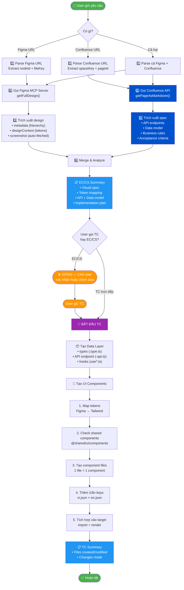
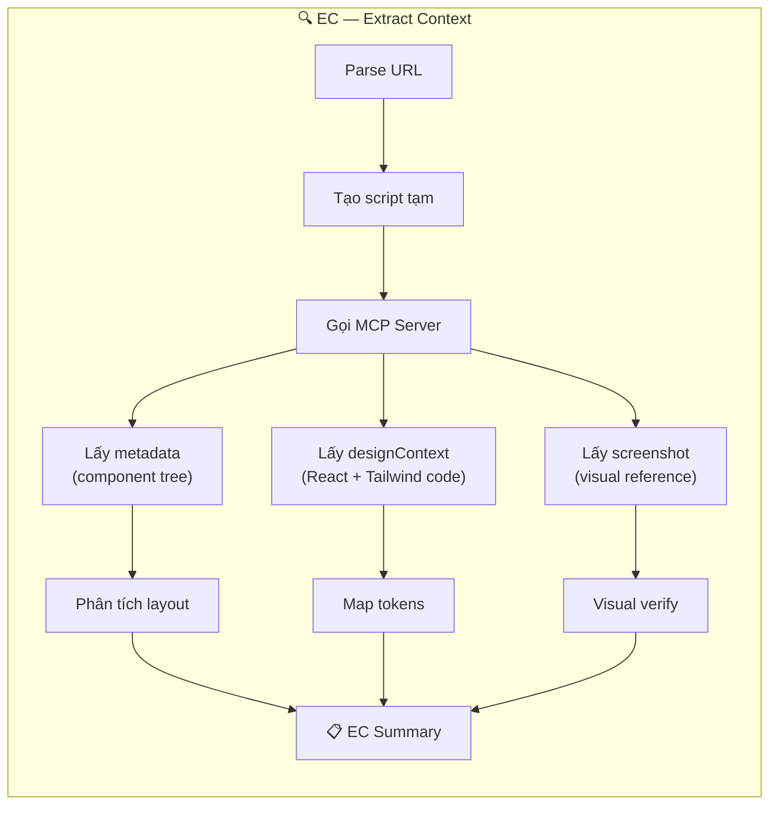
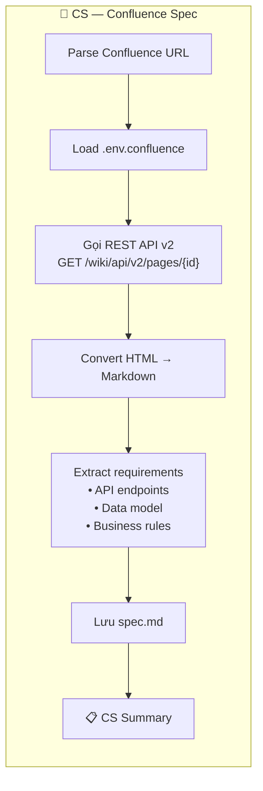
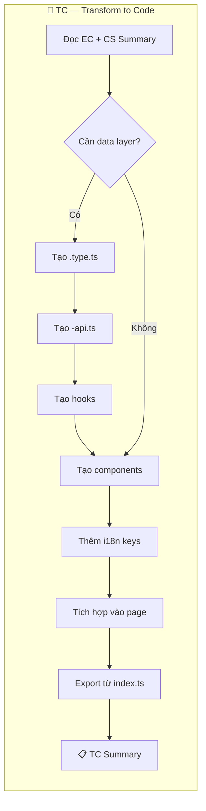

# Design-to-Code Skill — Hướng dẫn sử dụng

## Tổng quan

Skill này chuyển đổi thiết kế Figma + spec từ Confluence wiki thành code React/TypeScript tuân thủ 100% design system của dự án.

| Bước  | Lệnh                     | Mô tả                                                 |
| ----- | ------------------------ | ----------------------------------------------------- |
| **1** | `EC` (Extract Context)   | Trích xuất thông tin từ Figma → phân tích thiết kế    |
| **2** | `CS` (Confluence Spec)   | Fetch spec từ Confluence wiki → convert sang markdown |
| **3** | `TC` (Transform to Code) | Chuyển đổi thiết kế + spec → code hoàn chỉnh          |
| **4** | `EC + TC` (Combined)     | Chạy cả hai bước trong một câu lệnh                   |

---

## Cách sử dụng

### Bước 1 — EC (Extract Context)

**Cú pháp:**

```
EC [Figma URL] [target file/folder path]
```

**Ví dụ:**

```
EC https://www.figma.com/design/ZeyTEkt0ihWivEWASGKQfr/...?node-id=33643-10129&m=dev @[apps/client/src/app/(protected)/components/Sidebar.tsx]
```

**Agent sẽ tự động:**

1. Parse Figma URL → lấy `nodeId` và `fileKey`
2. Tạo script tạm `extract_figma.mjs` để gọi `figma_mcp_client.js`
3. Gọi `getFullDesign()` → lấy metadata, design context, screenshot
4. Phân tích design tokens, layout, components
5. **Lưu file raw** (vào `target_folder/module_name/`):
   - `designContext.txt`
   - `metadata.xml`
   - `screenshot.png`
6. Trả về **EC Summary**:
   - Mô tả visual spec (kích thước, spacing, colors, typography)
   - Token mapping (Figma values → Tailwind tokens)
   - Kế hoạch implementation
7. Xoá script tạm

**EC Summary mẫu:**

```markdown
## 🔍 EC — Sidebar Hotline Widget

### Visual Spec

- Container: p-4, gradient bg, rounded-xl
- Label: text-sm font-medium
- Button: rounded-full, bg-white/40

### Token Mapping

- text-brand → phone number color
- Headset → lucide-react icon

### Implementation Plan

- Component: SidebarHotlineWidget.tsx
- Integration: Bottom of Sidebar.tsx
```

> **Lưu ý**: Sau EC, agent sẽ **DỪNG** và chờ user xác nhận.

---

### Bước 2 — CS (Confluence Spec)

**Cú pháp:**

```
CS [Confluence URL]
CS [Confluence URL 1] [Confluence URL 2]
```

**Ví dụ:**

```
CS https://vietnixvn.atlassian.net/wiki/spaces/VEV/pages/141033474/Client+Portal+-+v2+...
```

**Agent sẽ tự động:**

1. Parse Confluence URL → lấy `spaceKey`, `pageId`
2. Tạo script tạm gọi `confluence_mcp_client.js`
3. Gọi `getPageAsMarkdown()` → fetch page content via REST API v2
4. Convert Confluence Storage Format HTML → clean Markdown
5. Extract requirements: API endpoints, data model, business rules, UI rules
6. **Lưu file**: `spec.md` trong target folder
7. Trả về **CS Summary**:
   - API endpoints + request/response shape
   - Data model fields + types
   - Business rules + acceptance criteria
   - UI requirements

**Yêu cầu:**

- File `.env.confluence` phải có `CONFLUENCE_EMAIL` và `CONFLUENCE_API_TOKEN`
- Tạo API token tại: https://id.atlassian.com/manage-profile/security/api-tokens

---

### Bước 3 — TC (Transform to Code)

**Cú pháp:**

```
TC                                                                               ← Sau EC/CS
TC [Figma URL] spec=[Confluence URL] [target folder]                             ← 1 screen + spec
TC [Figma URL 1] [Figma URL 2] [Figma URL 3] spec=[Confluence URL] [target]      ← Multi-screen + spec
```

Gõ `TC` sau khi EC/CS hoàn tất, hoặc gộp tất cả trong 1 câu lệnh.

**Agent sẽ tự động:**

1. Fetch tất cả Figma screens + Confluence spec (nếu chưa EC/CS trước)
2. Tạo data layer (types, API, hooks) từ spec
3. Map Figma tokens → Tailwind classes cho từng screen
4. Sử dụng shared components thay vì tạo mới
5. Thêm i18n keys vào `vi.json` + `en.json`
6. Tích hợp vào component/page đích
7. Trả về **TC Summary** với danh sách files đã tạo/sửa

---

## Các format input được hỗ trợ

| Input                              | Độ chính xác | Khi nào dùng                             |
| ---------------------------------- | ------------ | ---------------------------------------- |
| Multi-Figma URLs + Confluence Spec | ⭐ Tốt nhất  | Full feature: nhiều screens + data layer |
| Figma URL + Confluence Spec        | ⭐ Tốt nhất  | Combo hoàn hảo: design + data layer      |
| Figma URL + Requirements           | ✅ Rất tốt   | Hầu hết các trường hợp                   |
| Figma URL only                     | ✅ Tốt       | Screenshot được tự động lấy từ MCP       |
| Confluence Spec only               | ⚠️ OK        | Có data layer, nhưng thiếu design tokens |

---

## ⭐ Kết hợp Multi-Figma + Confluence Spec (Khuyến nghị)

### Ví dụ: 3 screens + 1 spec

```
TC https://www.figma.com/design/...?node-id=100-1
   https://www.figma.com/design/...?node-id=100-2
   https://www.figma.com/design/...?node-id=100-3
   spec=https://vietnixvn.atlassian.net/wiki/spaces/VEV/pages/141033474/...
   @[apps/client/src/app/(protected)/services/vps]
```

Agent sẽ:

1. Fetch Confluence spec → extract API endpoints, data model, business rules
2. Fetch tất cả 3 Figma screens → extract tokens, layout, components cho từng screen
3. Merge → tạo ONE shared data layer (types, API, hooks)
4. Tạo UI components riêng cho mỗi screen
5. Tích hợp tất cả vào page

### Ví dụ: 1 screen + 1 spec

```
TC https://www.figma.com/design/...?node-id=33622-12861&m=dev
   spec=https://vietnixvn.atlassian.net/wiki/spaces/VEV/pages/141033474/...
   @[apps/client/src/app/(protected)/services/vps]
```

### Kết hợp với manual API spec

Nếu Confluence chưa có đầy đủ API spec, bổ sung thủ công:

```
TC https://www.figma.com/design/...?node-id=100-1
   https://www.figma.com/design/...?node-id=100-2
   spec=https://vietnixvn.atlassian.net/wiki/spaces/VEV/pages/141033474/...
   @[apps/client/src/app/(protected)/profile]

   API bổ sung: GET /v1/billing-infos
   JSON: { "companyName": "...", "taxId": null, "address": "...", "email": "..." }
```

---

## Flow diagram

### Workflow tổng quan



### Chi tiết từng bước EC



### Chi tiết từng bước CS



### Chi tiết từng bước TC



---

## Nguyên tắc quan trọng

### ⛔ KHÔNG được làm

- Hardcode hex colors: `text-[#007dfc]` → dùng `text-brand`
- Arbitrary spacing: `p-[17px]` → dùng `p-4` hoặc `p-5`
- Inline styles cho design tokens: `style={{ color: '#xxx' }}`
- Tạo component mới khi đã có shared component
- Đoán API spec từ design — lấy từ Confluence hoặc hỏi user

### ✅ PHẢI làm

- Dùng token từ `globals.css` + `tailwind-preset.ts`
- Reuse component từ `@shared/ui/components`
- Thêm i18n keys cho **cả** `vi.json` và `en.json`
- Tách file: 1 component = 1 file
- Data layer trước UI
- Fetch Confluence spec trước khi code (nếu có URL)

---

## Yêu cầu hệ thống

### Figma

- **Figma Desktop App** phải đang mở với file thiết kế
- **Figma MCP Server** phải đang chạy (`localhost:3845`)
- File `figma_mcp_client.js` phải tồn tại ở project root

### Confluence

- File `.env.confluence` với `CONFLUENCE_EMAIL` và `CONFLUENCE_API_TOKEN`
- File `confluence_mcp_client.js` phải tồn tại ở project root
- API token tạo tại: https://id.atlassian.com/manage-profile/security/api-tokens
